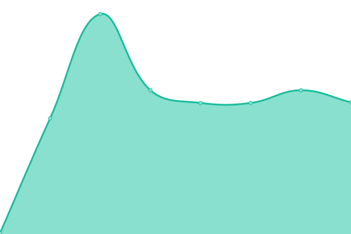

# [📈 Live Status](https://status.konstantin-beug.de): <!--live status--> **🟧 Partial outage**

This repository contains the open-source uptime monitor and status page for [Upptime](https://upptime.js.org), powered by [Upptime](https://github.com/upptime/upptime).

With [Upptime](https://upptime.js.org), you can get your own unlimited and free uptime monitor and status page, powered entirely by a GitHub repository. We use [Issues](https://github.com/upptime/upptime/issues) as incident reports, [Actions](https://github.com/sirmelonchen/status/actions) as uptime monitors, and [Pages](https://status.konstantin-beug.de) for the status page.

<!--start: status pages-->
<!-- This summary is generated by Upptime (https://github.com/upptime/upptime) -->
<!-- Do not edit this manually, your changes will be overwritten -->
<!-- prettier-ignore -->
| URL | Status | History | Response Time | Uptime |
| --- | ------ | ------- | ------------- | ------ |
|  [Homepage](https://konstantin-beug.de) | 🟩 Up | [homepage.yml](https://github.com/sirmelonchen/status/commits/HEAD/history/homepage.yml) | 

 160ms
     
 | 

<a href="https://status.konstantin-beug.de/history/homepage">11.64%</a>
    

|  [Webmail](https://webmail.konstantin-beug.de) | 🟩 Up | [webmail.yml](https://github.com/sirmelonchen/status/commits/HEAD/history/webmail.yml) | 

 165ms
     
 | 

<a href="https://status.konstantin-beug.de/history/webmail">11.68%</a>
    

|  [File Share](https://cloud.konstantin-beug.de) | 🟩 Up | [file-share.yml](https://github.com/sirmelonchen/status/commits/HEAD/history/file-share.yml) | 

 129ms
     
 | 

<a href="https://status.konstantin-beug.de/history/file-share">13.85%</a>
    

|  [VPN für Interne](85.215.55.12) | 🟥 Down | [vpn-fuer-interne.yml](https://github.com/sirmelonchen/status/commits/HEAD/history/vpn-fuer-interne.yml) | 

 186ms
     
 | 

<a href="https://status.konstantin-beug.de/history/vpn-fuer-interne">100.00%</a>
    

<!--end: status pages-->

[**Visit our status website →**](https://status.konstantin-beug.de)

## 📄 License

- Powered by: [Upptime](https://github.com/upptime/upptime)
- Code: [MIT](./LICENSE) © [Anand Chowdhary](https://anandchowdhary.com), supported by [Pabio](https://pabio.com)
- Data in the `./history` directory: [Open Database License](https://opendatacommons.org/licenses/odbl/1-0/)
